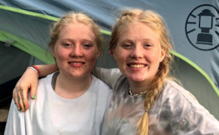
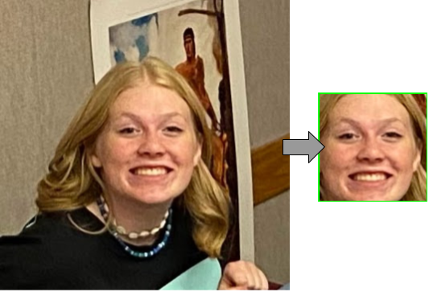
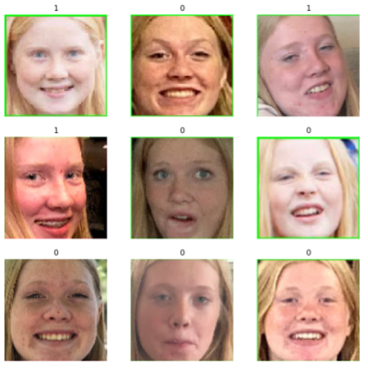

# twin_recognition

Trying to make a facial recognitin machine that can tell apart my twin little sisters better than google can.

## Introduction
Meet my little sisters: L (left) and K (right). 

Google Photos is an amazing program. Their auto identifier is my favorite feature. It can tell people apart and can give them their own folders. And it’s very good at sorting people… most of the time. I have identical twin sisters, and Google has a very hard time telling them apart and constantly misidentifying them. So I decided to try and make a model that can only tell these two apart.

## Data Tuning
The first hurdle was gathering the pixels. One twin was totally on board and sent over all her selfies. The other was, to put it lightly, not so accommodating. Luckily our Mom was very supportive and let me go through all of her pictures. I limited it to only pictures from the last couple of years since their faces have changed a lot as they’ve grown up. Then only pictures where their faces are unobstructed. After all of this sorting, I was left with 80 pictures of K and 75 pictures of L. 

But the model was having a lot of trouble when I sent in the raw pictures. It was given too many outside factors and overfitting on those. So I found a tutorial that could extract only the face from the photo.

Of course, it sometimes misidentified a pipe in the background or the couch pattern as a face, and in some files, it found no faces at all and threw them out. When it was all done, I was left with 64 K and 53 L pictures for a total of 117 training photos.

Of course, I also needed a test set, so I scrounged together 25 new photos. I didn’t do the face zoom on the test set because the face zoomer couldn’t find the face in all of the photos and made it hard to validate.

## The Model
I decided to make my own CNN Sequential model. It has 5 convolutional layers which try to go through and find all of the different features that can tell these two apart. It was then compiled with the ‘adam’ optimizer. I decided on 75 epochs because even though the loss levels off around 50 it was the level that gave the best results.

## The Results
I made a survey of the test data set and had three groups fill it out: Strangers, Extended Family, and Immediate family and got their accuracy scores:

|            GROUP | ACCURACY |
|-----------------:|----------|
|        Strangers | 58%      |
|  Extended Family | 85%      |
| Immediate Family | 98%      |
|    ***Google Photos*** | ***50%***      |
|         ***My Model*** | ***76%***      |

My model lands squarely in the middle between strangers and extended family. But it is far and away better than google photos. I found the google photos score by going back through my test photos and finding out where they were sorted. Some had listed both in the picture and I threw those out, but of the 20 left it was only 50% accurate- worse than strangers.

## Conclusion
My neural network was able to become better at telling my twin sisters apart not only than Google but better than strangers. I think with more hyper tuning, data, and time I could train it to become better than Extended Family too. But I don’t think I could ever get it better than Immediate family - they just look too much alike.

## Links
### Python Gist

### Resources
[Cropping Faces from Images using OpenCV – Python](https://www.google.com/url?q=https://www.geeksforgeeks.org/cropping-faces-from-images-using-opencv-python/&sa=D&source=docs&ust=1643328048164019&usg=AOvVaw2jqds9_VsS4oJswS_rfi4n)

[Image classification](https://www.tensorflow.org/tutorials/images/classification)
